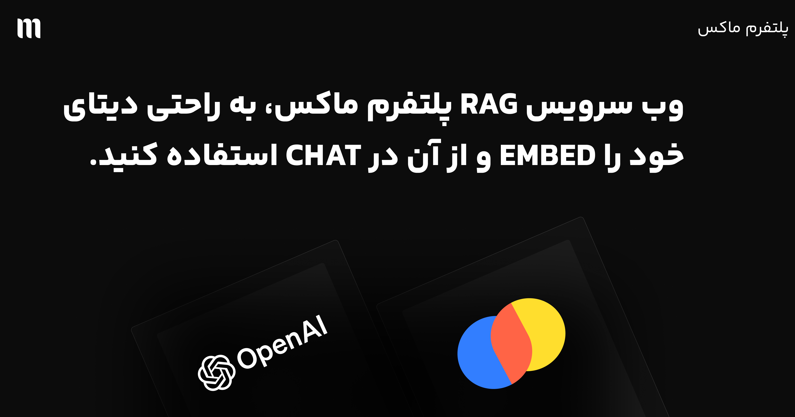

<div dir="rtl">

# 🚀 Maux RAG API


 ماکس افتخار دارد سیستمی قدرتمند برای پیاده‌سازی RAG را معرفی نماید. با استفاده از این API، می‌توانید به سادگی و با بهره‌گیری از OpenAI و ChromaDB، سیستم هوشمند خود را راه‌اندازی نمایید. 🎉

## ✨ چرا API ماکس؟

- 🚀 نصب و راه‌اندازی فوق‌العاده آسون
- 📚 ذخیره هوشمند اطلاعات با ChromaDB 
- 🔍 جستجوی پیشرفته و دقیق توی محتوا
- 🤖 کاملاً سازگار با OpenAI
- ⚡️ پاسخ‌دهی سریع (هم streaming و هم non-streaming)
- 🎯 جایگزین عالی برای API اصلی OpenAI با قابلیت RAG
- 🔌 نصب و استفاده در عرض چند دقیقه!

## 🎮 شروع کنید

۱. ریپو را کلون کنید
۲. نصب وابستگی‌ها با دستور زیر:
```bash
pip install -r requirements.txt 
```

<div dir="rtl">
۳. متغیرهای محیطی را در فایل env. تنظیم کنید:
</div>

```bash
OPENAI_API_KEY=your_openai_api_key
CHROMA_PERSIST_DIRECTORY=./chroma_db
OPENAI_EMBEDDING_MODEL=text-embedding-3-small
CHAT_MODEL=gpt-4o-mini
RAG_SEARCH_LIMIT=3
SYSTEM_PROMPT="You are a helpful assistant. Use the provided context to answer the user's question. If the context is not relevant, just say 'I don't know'"
```

<div dir="rtl">
## 🚀 شروع سریع

سرور API را اجرا کنید:
</div>

```bash
uvicorn app.main:app --host 0.0.0.0 --port 8000
## 🔄 سازگاری با OpenAI و AvalAI

این API به گونه‌ای طراحی شده که جایگزین مستقیم API اصلی OpenAI و AvalAI باشد، با قابلیت‌های اضافه RAG:

- سازگار با کتابخانه‌های کلاینت OpenAI و AvalAI
- پشتیبانی از پاسخ‌های streaming و non-streaming
- حفظ فرمت پاسخ‌دهی مشابه با OpenAI
- کافیست `base_url` را در کلاینت OpenAI خود تغییر دهید
- دسترسی آسان به API از داخل ایران با استفاده از AvalAI بدون نیاز به VPN
- امکان انتخاب بین OpenAI و AvalAI با تنظیم ساده در فایل .env

## 📚 مستندات API

### اندپوینت‌های پایگاه داده برداری

- `POST /v1/vector_db/initialize_collection`: راه‌اندازی پایگاه داده برداری
- `POST /v1/vector_db/add_document`: افزودن سند با متادیتای اختیاری
- `POST /v1/vector_db/search_documents`: جستجو برای اسناد مشابه

### اندپوینت‌های چت

- `POST /v1/chat/completions`: اندپوینت سازگار با OpenAI برای تکمیل چت
  - پشتیبانی از پاسخ‌های streaming و non-streaming
  - بازیابی خودکار محتوای مرتبط از پایگاه داده برداری
  - حفظ فرمت پاسخ‌دهی OpenAI

برای شروع کار با API و دیدن مثال‌های کاربردی، به پوشه examples مراجعه کنید. در آنجا نمونه کدهای کامل برای استفاده از تمام قابلیت‌های API را خواهید یافت.

</div>

---

# 🚀 MAUX INC RAG API

Welcome to the MAUX INC RAG API! This powerful API enables you to create a Retrieval-Augmented Generation (RAG) system using OpenAI's chat completions and embeddings, along with ChromaDB for efficient document storage and retrieval.

## 🌟 Features

- 📚 Document embedding and storage with ChromaDB
- 🔍 Semantic search for relevant context
- 🤖 OpenAI-compatible API endpoints
- 🔄 Support for both streaming and non-streaming responses
- 🎯 Drop-in replacement for OpenAI's API with RAG capabilities
- 🔗 Easy integration with existing OpenAI clients

## 🛠️ Installation

1. Clone the repository
2. Install dependencies:
```bash
pip install -r requirements.txt 
```

3. Set up your environment variables in a .env file
```bash
OPENAI_API_KEY=your_openai_api_key
CHROMA_PERSIST_DIRECTORY=./chroma_db
OPENAI_EMBEDDING_MODEL=text-embedding-3-small
CHAT_MODEL=gpt-4o-mini
RAG_SEARCH_LIMIT=3
SYSTEM_PROMPT="You are a helpful assistant. Use the provided context to answer the user's question. If the context is not relevant, just say 'I don't know'"
```

## 🚀 Quick Start

Start the API server:
```bash
uvicorn app.main:app --host 0.0.0.0 --port 8000
```

## 💡 Usage Examples

### 1. Adding Content

```python
import requests

BASE_URL = "http://localhost:8000/v1"

# Add documents with metadata
def add_documents():
    documents = [
        {
            "text": "MAUX INC Q4 2023 Revenue: $12.5M with 45% YoY growth",
            "metadata": {"source": "financial_report", "date": "2023-Q4"}
        },
        {
            "text": "MAUX INC Product: Enterprise AI solutions starting at $499/month",
            "metadata": {"source": "product_docs", "date": "2024-01"}
        }
    ]
    
    for doc in documents:
        response = requests.post(f"{BASE_URL}/vector_db/add_document", json=doc)
        print(f"Added document:", response.json())

add_documents()
```

### 2. Using with OpenAI Python Client (Non-Streaming)

```python
from openai import OpenAI

# Initialize client with RAG API endpoint
client = OpenAI(
    base_url="http://localhost:8000/v1",
    api_key="dummy-key"  # API key is not used but required
)

# Simple completion
response = client.chat.completions.create(
    model="gpt-4o-mini",  # Model name is configurable in .env
    messages=[
        {"role": "system", "content": "You are a helpful assistant."},
        {"role": "user", "content": "What was MAUX INC's revenue in Q4 2023?"}
    ]
)

print(response.choices[0].message.content)
```

### 3. Streaming Responses

```python
from openai import OpenAI

client = OpenAI(
    base_url="http://localhost:8000/v1",
    api_key="dummy-key"
)

def stream_chat():
    messages = [
        {
            "role": "system",
            "content": "You are a knowledgeable assistant with access to MAUX INC data."
        },
        {
            "role": "user", 
            "content": "Tell me about MAUX INC's products and pricing?"
        }
    ]

    # Stream the response
    stream = client.chat.completions.create(
        model="gpt-4o-mini",
        messages=messages,
        stream=True
    )

    for chunk in stream:
        if chunk.choices[0].delta.content:
            print(chunk.choices[0].delta.content, end="")
    print()

stream_chat()
```

### 4. Using with curl (REST API)

```bash
# Non-streaming chat completion
curl -X POST "http://localhost:8000/v1/chat/completions" \
  -H "Content-Type: application/json" \
  -d '{
    "model": "gpt-4o-mini",
    "messages": [
      {"role": "user", "content": "What services does MAUX INC offer?"}
    ]
  }'

# Streaming chat completion
curl -X POST "http://localhost:8000/v1/chat/completions" \
  -H "Content-Type: application/json" \
  -d '{
    "model": "gpt-4o-mini",
    "messages": [
      {"role": "user", "content": "What services does MAUX INC offer?"}
    ],
    "stream": true
  }'
```

## 🔄 OpenAI Compatibility

The API is designed to be a drop-in replacement for OpenAI's API with added RAG capabilities:

- Compatible with OpenAI's client libraries
- Supports both streaming and non-streaming responses
- Maintains the same response format as OpenAI
- Simply change the `base_url` in your existing OpenAI client

## 📚 API Reference

### Vector Database Endpoints

- `POST /v1/vector_db/initialize_collection`: Initialize the vector database
- `POST /v1/vector_db/add_document`: Add a document with optional metadata
- `POST /v1/vector_db/search_documents`: Search for similar documents

### Chat Endpoints

- `POST /v1/chat/completions`: OpenAI-compatible chat completions endpoint
  - Supports both streaming and non-streaming responses
  - Automatically retrieves relevant context from the vector database
  - Maintains OpenAI's response format

## 📝 License

This project is licensed under the MIT License

## 🤝 Contributing

Contributions are welcome! Please feel free to submit a Pull Request.
</div>