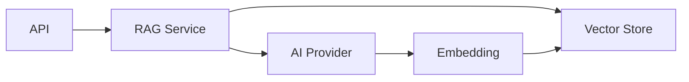
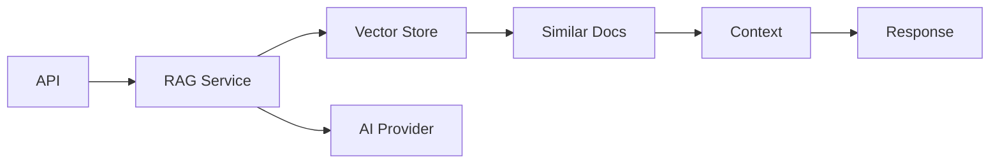

# 🏗️ معماری فنی سیستم

## 📑 فهرست
- [معماری کلی](#معماری-کلی)
- [اجزای اصلی](#اجزای-اصلی)
- [جریان داده](#جریان-داده)
- [ماژول‌ها](#ماژول‌ها)

## 🎯 معماری کلی

سیستم از یک معماری لایه‌ای استفاده می‌کنه که شامل این بخش‌هاست:

```
┌─────────────┐
│    API      │ ← FastAPI
├─────────────┤
│  Services   │ ← RAG + AI Providers
├─────────────┤
│ Vector DB   │ ← ChromaDB
└─────────────┘
```

## 🧩 اجزای اصلی

### 1. لایه API (`app/routes/`)
- `chat.py`: مدیریت درخواست‌های چت
- `vector_db.py`: مدیریت عملیات پایگاه داده برداری

### 2. لایه سرویس (`app/services/`)
- `core/`
  - `rag_service.py`: منطق اصلی RAG
  - `vector_store.py`: مدیریت ChromaDB
- `providers/`
  - `openai_service.py`: ارتباط با OpenAI
  - `avalai_service.py`: ارتباط با AvalAI
- `base.py`: کلاس‌های پایه

### 3. مدل‌ها (`app/models/`)
- `chat.py`: مدل‌های مربوط به چت
- `embedding.py`: مدل‌های مربوط به امبدینگ

## 🔄 جریان داده

### 1. افزودن سند


### 2. پرسش و پاسخ


## 📦 ماژول‌ها

### RAG Service
مسئول هماهنگی بین اجزای مختلف:
```python
class RAGService:
    def __init__(self):
        self.collection_name = "RAG_COLLECTION"
        self.vector_store = VectorStoreService()
        self._provider = None  # Lazy loading

    @property
    def provider(self):
        # انتخاب پروایدر بر اساس تنظیمات
        if self._provider is None:
            if settings.PROVIDER == "openai":
                self._provider = OpenAIProvider()
            elif settings.PROVIDER == "avalai":
                self._provider = AvalaiProvider()
        return self._provider
```

### AI Providers
اینترفیس یکسان برای پروایدرهای مختلف:
```python
class BaseAIProvider(ABC):
    @abstractmethod
    def create_embedding(self, text: str) -> List[float]:
        pass

    @abstractmethod
    def create_chat_completion(self, messages: list, model: str) -> Any:
        pass
```

### Vector Store
مدیریت ذخیره‌سازی و جستجوی وکتور ها:
```python
class VectorStoreService:
    def __init__(self):
        self.client = chromadb.PersistentClient(
            path=settings.CHROMA_PERSIST_DIRECTORY
        )
```

## 🔧 تنظیمات و پیکربندی

تنظیمات در `app/config/settings.py`:
```python
class Settings(BaseSettings):
    PROVIDER: Literal["openai", "avalai"] = "openai"
    OPENAI_API_KEY: str
    AVALAI_API_KEY: Optional[str] = None
    # ...
```

## 🛠️ توسعه و گسترش

### افزودن پروایدر جدید
1. یک کلاس جدید در `providers/` بسازید
2. از `BaseAIProvider` تبعیت  کنید
3. متدهای OpenAI-compatible رو پیاده‌سازی کنید:
   - `create_embedding`: باید خروجی سازگار با OpenAI Embeddings API داشته باشه
   - `create_chat_completion`: باید خروجی سازگار با OpenAI Chat Completion API داشته باشه
4. به `RAGService` اضافه کنید

### تغییر پایگاه داده vector
1. یک کلاس جدید برای پایگاه داده بسازید
2. اینترفیس مشابه `VectorStoreService` پیاده‌سازی کنید که با فرمت OpenAI embeddings سازگار باشه
3. در `RAGService` استفاده کنید

## 📊 مانیتورینگ و لاگینگ

سیستم از `logging` استاندارد پایتون استفاده می‌کنه:
```python
logging.basicConfig(level=logging.INFO)
logger = logging.getLogger(__name__)
```

## 🔒 امنیت

1. **API Keys**
   - ذخیره در فایل `.env`
   - بررسی در زمان اجرا

2. **Validation**
   - استفاده از Pydantic برای اعتبارسنجی
   - چک کردن ورودی‌ها در API

3. **Rate Limiting**
   - پیاده‌سازی نشده (می‌تونید اضافه کنید)

